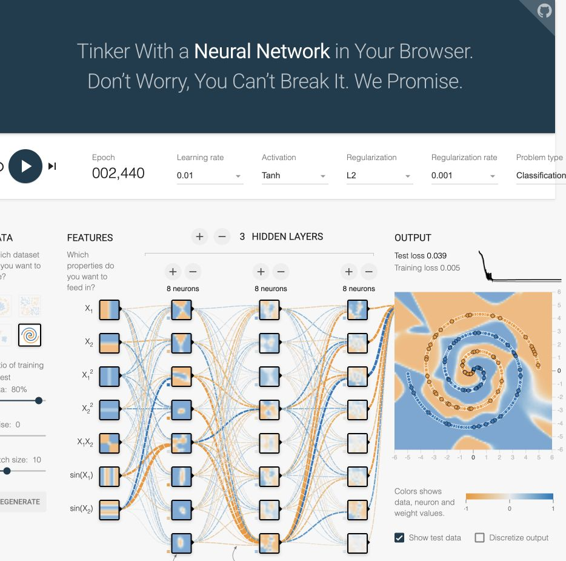

# Challenge 2: Tensorflow Hyperparameter Tuning

## Getting Started

From the lesson and Challenge 1 you should have noticed that understanding the concepts in neural network analysis such as *learning rate*, *epoch*, *optimizer*, *loss function* and so on is essential for you to optimize the neural network models you build. In this challenge you will study several learning pieces that discuss the hyperparameters in Tensorflow. 

**[Neural Networks: Structure](https://developers.google.com/machine-learning/crash-course/introduction-to-neural-networks/anatomy)**

**[Understanding Deep Learning with TensorFlow Playground](https://medium.com/@andrewt3000/understanding-tensorflow-playground-c20cdb7a250b)**

After that, complete [this exercise](https://developers.google.com/machine-learning/crash-course/introduction-to-neural-networks/playground-exercises) on tuning the Tensorflow hyperpamameters in the [Tensorflow Playground](https://playground.tensorflow.org/).

Finally, using what you have learned, try tuning the hyperparameters for the spiral dataset in order to reach training and test loss <0.05 as shown in the following:

After you're done, submit a screenshot of your Playground including the following information:

* Epoch
* Learning rate
* Activation function
* Features included
* Hidden layers and neurons
* Test and training loss

**Do not google for the end solution!**

## Completed experiment

| Setting | Value |
| --- | --- |
| Epoch | 2,440 |
| Learning rate | 0.01 |
| Activation | Tanh |
| Features | x₁, x₂, x₁², x₂², x₁x₂, sin(x₁), sin(x₂) |
| Hidden layers | 8, 8, 8 neurons |
| Regularization | L2, rate 0.001 |
| Training/test split | 80% / 20% |
| Noise / batch size | 0 / 10 |
| Training loss | 0.005 |
| Test loss | 0.039 |
| Seed | 0.20556 |

Both displayed losses are below 0.05. These values come from the actual paused browser experiment, not the provided example image.

### Tuning observations

With three 8-neuron layers, raw x/y inputs and a learning rate of 0.03, the 50/50 split reached training loss 0.000 (rounded) but test loss 0.078 at epoch 5,764. Adding all seven visible features gave losses 0.064 / 0.142 (training/test) at epoch 1,371. Continuing that run with learning rate 0.01 gave 0.008 / 0.072 at epoch 5,735.

A fresh run with 80% training data and learning rate 0.01 reached 0.001 / 0.055 at epoch 3,063. Adding L2 regularization at 0.001 and restarting produced the successful result above. Regularization discourages large weights and helped this run generalize. Changing the split also changes the test set, so those scores are not a controlled comparison. Because Playground test loss guided tuning, it is a development score rather than an unbiased final estimate.

[Open the final configuration](https://playground.tensorflow.org/#activation=tanh&regularization=L2&batchSize=10&dataset=spiral&learningRate=0.01&regularizationRate=0.001&noise=0&networkShape=8,8,8&seed=0.20556&showTestData=true&percTrainData=80&x=true&y=true&xTimesY=true&xSquared=true&ySquared=true&sinX=true&sinY=true&problem=classification). The link restores settings, not trained weights; press Play to train again.

### Concepts and exercise responses

An epoch is one pass over the training examples. The learning rate controls update size; a large value can make training unstable, while a small value can slow progress. Nonlinear activations allow curved decision boundaries; stacking only linear layers still produces a linear mapping. Wider/deeper networks increase capacity but may overfit. These concepts follow Google's [nodes and hidden layers](https://developers.google.com/machine-learning/crash-course/neural-networks/nodes-hidden-layers) and [activation functions](https://developers.google.com/machine-learning/crash-course/neural-networks/activation-functions) lessons.

The original Google exercise URL is unavailable. For the current [interactive exercises](https://developers.google.com/machine-learning/crash-course/neural-networks/interactive-exercises), the conceptual answers are:

1. Zero inputs do not guarantee zero output: biases can produce positive activations. ReLU makes the final output nonnegative.
2. Inserting a hidden layer changes the existing output node's calculation; earlier layers are unaffected during inference.
3. Changing a weight into the second hidden neuron can affect that neuron and its descendants, but not its siblings. A changed calculation need not change its value, especially with zero inputs or inactive ReLU units.
